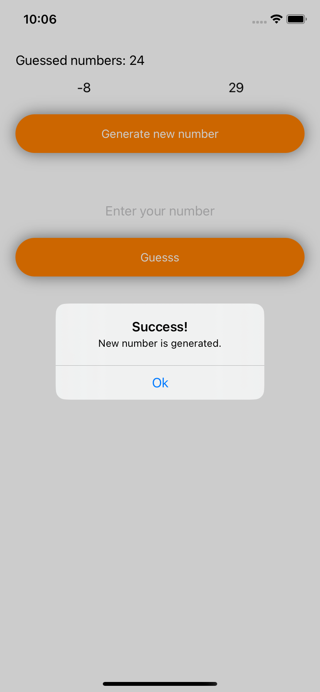

# GuessTheNumberSimpleApp
This is my test small MVVM project
***
###Description
>In this app you have to guess the number, that iPhone generate in
some range. There is the scores of your right guessed numbers, which
are stored in UserDefaults.
***
###Software stack of knowledge
>Swift, UIKit, UserDefaults, NSLayoutConstraint, UIView.animate etc.

>MVVM
***
###Screenshots
***

***
